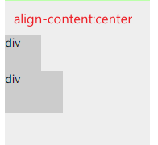
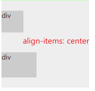
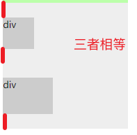
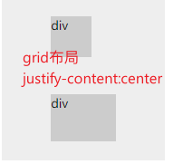
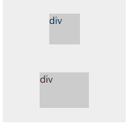
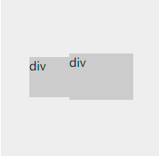
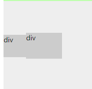

# CSS

## position （定位）常用属性值

- **static**
  - 元素在文档流中定位的默认值
- **relative**
  - 相对定位（相对于**自己**在文档流中本来的位置）

- **absolute**
  - 绝对定位（被移出文档流，相对于第一个`非 static` 定位的祖先元素定位）
- **fixed**
  - 固定定位（默认情况相对于视口进行定位，当元素的祖先元素的 `transform`, `perspective` 或 `filter` 属性非 `none` 时，容器由视口改为该祖先。）
- **sticky**
  - 粘性定位（可以被认为是相对定位和固定定位的混合。元素在跨越特定阈值前为相对定位，之后为固定定位）
  - 一般用来做吸顶的效果
  - 阈值 有上、右、下、左四种

## display （布局）常用属性值

| inline                                         | block                                        | inline-block               |
| ---------------------------------------------- | -------------------------------------------- | -------------------------- |
| 共享一行 内容撑开 margin只有左右生效 | 独占一行 可设置宽高 默认填满父元素 | 共享一行 可设置宽高   |
| span em label a                 | div h1-h6 li nav                   | button input img |

其实如果面试官问这个问题，他最想听到的是 `flex` 和 `grid` 布局，由于这两者十分重要，下文专门介绍。

## flex布局

两个概念、六个api

- 容器：用来开启 flex 布局的父元素
- 项目：flex 布局的子元素

- flex-direction
  - 可选值：row | row-reverse | column | column-reverse
  - 决定 `主轴` 的方向，或者说放置项目的方式，如果是 `row` 就像个正常人，一行一行地放；如果是 `column` 就像玩小猫钓鱼 ，一列一列地放。
- flex-wrap
  - 可选值： nowrap | wrap | wrap-reverse
  - 决定容器内项目是否可以换行。nowrap 可能会导致项目溢出容器或被压缩；wrap 正常换行；wrap-reverse 从 `交叉轴` 的末端开始放置容器，正常换行。
- flex-flow
  - flex-direction 和 flex-wrap 的缩写形式
- justify-content
  - 可选值：

## grid布局

| flex-direction                                               | flex-wrap                                                   | flex-flow             | justify-content                                              | align-items                                     | align-content                                                |
| ------------------------------------------------------------ | ----------------------------------------------------------- | --------------------- | ------------------------------------------------------------ | ----------------------------------------------- | ------------------------------------------------------------ |
| row\|row-reverse\|column\|column-reverse 决定主轴的方向，即项目的排列方向 | no-wrap\|wrap\|wrap-reverse 决定容器内项目是否可以换行 | direction和wrap的简写 | flex-start\|flex-end\|center\|space-between\|space-around\|space-evenly 项目在主轴上的对齐方式，其中space-aroud和space-evenly的区别在于头尾间隔的大小 | stretch\|flex-start\|flex-end\|center\|baseline | flex-start\|flex-end\|center\|space-between\|space-around\|stretchjj |

flex-grow 和 flex-shrink 按照项目的比例处理剩余距离和溢出距离

align-content 和 align-items 的区别

align-content 是将项目视作一整个内容区域进行布局，align-items实际上是项目（items）的align-self默认值

| align-content:center                                         | align-items:center                                           | align-content:space-around                                   |
| ------------------------------------------------------------ | ------------------------------------------------------------ | ------------------------------------------------------------ |
|  |  |  |

| grid布局justify-content：center                              | grid布局justify-items：center                                | flex布局justify-content：center                              | flex布局justify-items：center                                |
| ------------------------------------------------------------ | ------------------------------------------------------------ | ------------------------------------------------------------ | ------------------------------------------------------------ |
|  |  |  |  |

## 垂直水平居中

最简单的方法：display:flex（父） margin: auto（子）

最优的方法：grid justify-items align-items center

- 水平居中
  - 行内元素：父元素 text-align : center
  - 块级元素
    - 确定宽度：
      - margin：0 auto；
      - 子绝父相，计算margin-left  （使用`calc(50% - width/2)` ）
      - 子绝父相，transformX
    - 未知宽度：
      - grid 布局 jutstify-content 或者 justify-items
      - flex布局 jutstify-content 或者 justify-items（着重讲一下content 和 items的区别）
- 垂直居中
  - 文本：line-height = height
  - 同上 align-items